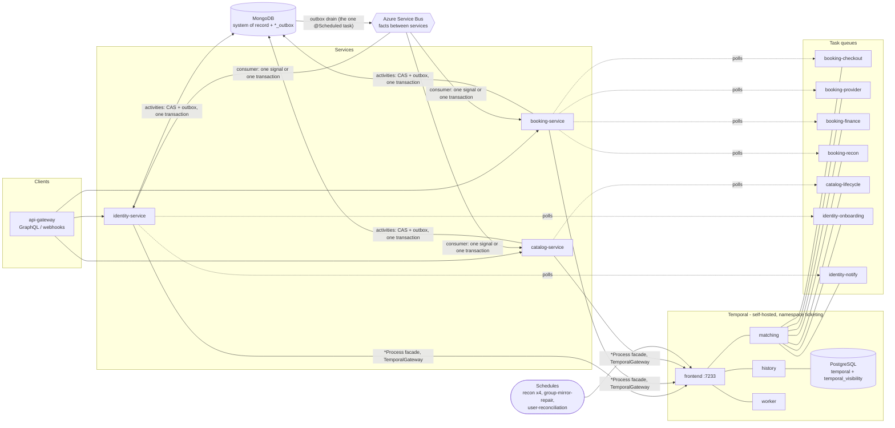

# Durable execution — how processes run on Temporal

**Normative source:** [`specs/_platform/015-durable-execution/spec.md`](../../specs/_platform/015-durable-execution/spec.md)
(ET-PLT-015) and [`specs/CONVENTIONS.md`](../../specs/CONVENTIONS.md) §3 and §9. This page is the
orientation: what runs where, the rules every change keeps, and how to add a process. Where it and
the spec disagree, the spec wins. Decision: ROADMAP D-21.

## 0 · Architecture at a glance

Per-flow reference (current code; ids are the ET-PLT-015 §4 registry):

| Service | Workflow | Queue | Workflow id | Kind |
|---|---|---|---|---|
| identity | `OrganizerOnboardingWorkflow` | `identity-onboarding` | `org-onboarding/{organizationId}` | approval to Keycloak roles |
| identity | `OwnershipTransferWorkflow` | `identity-onboarding` | `ownership/{transferId}` | multi-step handover |
| identity | `UserSyncWorkflow` | `identity-onboarding` | `user-sync/{keycloakUserId}` | long-lived, continues as new |
| identity | `UserBackfillWorkflow` | `identity-onboarding` | `user-backfill` | nightly Schedule `identity-user-reconciliation` |
| identity | `GroupMirrorRepair` (dynamic type) | `identity-onboarding` | Schedule `identity-group-mirror-repair`, every 60 s | repair |
| identity | `NotificationWorkflow` | `identity-notify` | `notify/{deduplicationKey}` | send with retries |
| identity | `ReminderWorkflow` | `identity-notify` | `reminder/{reminderId}` | timer |
| booking | `PurchaseWorkflow` | `booking-checkout` | `purchase/{reservationId}` | reserve, pay, ticket, 5-minute grace |
| booking | `PayoutWorkflow` | `booking-finance` | `payout/{escrowAccountId}` | settle or reverse |
| booking | `BankVerificationWorkflow` | `booking-finance` | `bank-verification/{bankAccountId}` | micro-deposit |
| booking | `EventFinanceWorkflow` | `booking-finance` | `event-finance/{eventId}` | escrow hold to event + 7 days |
| booking | `CancellationRefundsWorkflow` | `booking-finance` | `cancellation-refunds/{eventId}` | mass refund, child `RefundWorkflow`s |
| booking | `RefundWorkflow` | `booking-finance` | `refund/{ticketId}` | human approval, escalation at 2 and 5 days |
| booking | `ChargebackWorkflow` | `booking-finance` | `chargeback/{providerChargebackId}` | deadline alert |
| booking | `ReconciliationWorkflow` | `booking-recon` | `recon/{type}/scheduled` | hourly Schedules |
| catalog | `EventApprovalWorkflow` | `catalog-lifecycle` | `event-approval/{eventId}` | admin review |
| catalog | `EventLifecycleWorkflow` | `catalog-lifecycle` | `event/{eventId}` | publish, complete, cancel |

`LatePaymentRefundWorkflow` (booking, `booking-checkout`) is implemented (`workflow/latepayment`); its D-33
trials are pending. The spec registry's Status column is the authority on whether a process is in code. Every
other registry row marked `planned` has no implementation yet.

---

## 1 · The shape

| Layer | Holds | Never holds |
|---|---|---|
| **Temporal** | each process's history, current step, timers, task queues, Schedules | the record — screens, reports and reconciliation never read workflow state |
| **MongoDB** | every business document and each service's `*_outbox` — the system of record | workflow history |
| **Service Bus** | facts between services (`catalog.EventCompleted`, `booking.TicketPurchased`, …) | a service's own next step |

- **Workflows decide; activities do.** Workflow code holds sequence, timers, retries and
  compensation. Activities are the only code that writes MongoDB or calls PawaPay, Keycloak or
  messaging; each is idempotent by compare-and-set and stages its outbox rows in its own transaction.
- **Callers reach a workflow only through its `*Process` facade** over
  `com.pml.shared.infrastructure.temporal.TemporalGateway` (shared-library). No resolver, controller, consumer or runner holds a
  `WorkflowClient`.
- **A consumer turns a fact into one transaction or one workflow signal**, carrying the envelope's
  `eventId` so the workflow drops a redelivery.
- **Recurring jobs are Temporal Schedules** with overlap policy `SKIP`. The outbox drain is the one
  `@Scheduled` task left in the platform.

Each service runs its client and its worker in its own process. Workers long-poll their task queues,
so any pod can carry any execution and a crashed pod's work goes to the next poll.

## 2 · What runs where (built)

| Service | Task queue | Workflows | Schedules |
|---|---|---|---|
| booking | `booking-checkout` | `PurchaseWorkflow`, `LatePaymentRefundWorkflow` | — |
| booking | `booking-provider` | PawaPay activities for payouts, refunds, micro-deposits | — |
| booking | `booking-finance` | `PayoutWorkflow`, `BankVerificationWorkflow`, `EventFinanceWorkflow`, `CancellationRefundsWorkflow`, `RefundWorkflow`, `ChargebackWorkflow` | — |
| booking | `booking-recon` | `ReconciliationWorkflow` | escrow, escrow-journal and alerts hourly; a weekly summary (D-24) |
| catalog | `catalog-lifecycle` | `EventLifecycleWorkflow`, `EventApprovalWorkflow` | — |
| identity | `identity-onboarding` | `OrganizerOnboardingWorkflow`, `OwnershipTransferWorkflow`, `UserSyncWorkflow`, `UserBackfillWorkflow`, `GroupMirrorRepair` (dynamic) | `identity-group-mirror-repair` (every 60 s), `identity-user-reconciliation` (03:30 UTC) |
| identity | `identity-notify` | `ReminderWorkflow`, `NotificationWorkflow` | — |

Workflow ids are business ids: `purchase/{reservationId}`, `late-refund/{reservationId}`, `payout/{escrowAccountId}`,
`event-finance/{eventId}`, `org-onboarding/{organizationId}`, `user-sync/{keycloakUserId}`,
`user-backfill`, and so on — the complete list, with conflict policies, is the ET-PLT-015 §4 registry.
The registry also declares workflows owned by specs not yet built (erasure, data export, audit
maintenance, queue admission, ticket expiry and transfer, webhook orphans, rollups, migrations,
device pruning, mass sends, organizer digests), each on a queue that already exists.

## 3 · Rules that are enforced

| Rule | Enforced by |
|---|---|
| Each service polls exactly its §4 queues, named by constants | `TemporalRegistryLintTest` |
| Every workflow interface in the tree is a §4 row on its service's queue | `TemporalRegistryLintTest` |
| `WorkflowClient` only in `infrastructure/temporal` and workflow packages | `TemporalRegistryLintTest` |
| No I/O, clock, randomness, threads or `getInfo().getWorkflowId()` in workflow code | `WorkflowDeterminismLintTest` |
| No activity references `StreamBridge`; workflow payload records carry no personal data | `WorkflowDeterminismLintTest` |
| `StreamBridge.send` only inside `EventBridge`, zero sites in every service | `EventPublicationLintTest` |
| `.block()` only on activity threads, boot runners and the drain | `BlockingCallLintTest`, BlockHound |
| A refusal keeps its `ErrorCode` from an update validator to the client | `com.pml.shared.workflow.Refusals`, the layer-3 tests |
| Every workflow's recorded history replays against the current code | each workflow's layer-3 test class |

## 4 · Adding a process

1. **Declare it first.** Add the row to the ET-PLT-015 §4 workflow registry — type, queue, id,
   conflict policy — and the workflow or Schedule to the owning spec's §4 and `spec.yaml`
   (`workflows:` / `schedules:`).
2. **Id and queue.** Add a function to the service's `WorkflowIds`; use an existing `TaskQueues`
   constant. A new queue is a registry row, a constant and a `spring.temporal.workers` entry together.
3. **Write the `*Rules` class** — durations, limits, retry and activity options — so the decisions are
   layer-1 testable.
4. **Workflow interface and implementation.** Updates with validators for commands that can be
   refused; signals for callbacks and facts; a query for progress. Carry business ids in the start;
   use `Workflow.currentTimeMillis`, `Workflow.await` and `Workflow.sleep` for time.
5. **Activities** in `@ActivityImpl` classes: one transaction per step, compare-and-set, outbox row
   inside it; refusals through `Refusals.forActivity`.
6. **The `*Process` facade** — the only way in, returning `Mono` and translating refusals.
7. **Tests.** A layer-3 class on `TestWorkflowEnvironment` covering every branch under time skipping,
   ending with a `WorkflowReplayer` replay of a recorded history; add the activity interface to the
   service's workflow registry test.
8. **Schedules** are created by an `ApplicationRunner` that tolerates `ScheduleAlreadyRunningException`,
   with overlap `SKIP` and a run or execution timeout.

## 5 · Changing a running workflow

Adding, removing or reordering a timer, an activity, a child workflow or a signal handler changes
the command sequence and breaks replay for executions already running. The replay test catches it in
CI; making it safe to deploy needs `Workflow.getVersion` around the change, or Worker Versioning
that pins short workflows to the build they started on. Changing a duration, an activity's arguments
or a retry policy is replay-safe.

`EventApprovalWorkflow` is the worked example. Its announcements (submitted, approved, rejected,
changes requested) were added behind two `Workflow.getVersion` markers, one per announcement point,
so an execution already past its submission still announces the decision it reaches later. Two
histories recorded from the implementation before the change live in
`catalog-service/src/test/resources/workflow-histories/` and must replay against the current one;
`EventApprovalWorkflowTest` fails if a marker is removed. Record such a history *before* editing a
workflow, not after.

## 6 · Running it

| Environment | Temporal | Connection |
|---|---|---|
| Local | `docker compose --profile temporal up -d dev_temporal` in `docker-resources` (SQLite file; Web UI on :8233; namespace `ticketing`) | `TEMPORAL_ADDRESS=127.0.0.1:7233`, `TEMPORAL_NAMESPACE=ticketing` |
| Tests | `TestWorkflowEnvironment` (layer 3); `TemporalDevServer` Testcontainers fixture (layer 2) | in-process |
| Staging, production | a self-hosted Temporal service (ROADMAP D-28), defined in [`docker-resources/temporal/self-hosted/`](../../docker-resources/temporal/self-hosted/README.md): PostgreSQL `temporal` and `temporal_visibility`, namespace `ticketing`, 30-day retention, 512 history shards, custom search attributes | `prod` profile: `TEMPORAL_ADDRESS`, `TEMPORAL_NAMESPACE`, `TEMPORAL_TLS_ENABLED` |

To run the production-shaped stack locally: `cd docker-resources/temporal/self-hosted && cp .env.example .env && docker compose up -d`
(gRPC 7233, UI 8233; stop the developer server first or change the ports in `.env`).

Status: the stack is configured and starts locally, but **no staging or production environment is
provisioned and the D-33 trials have not run**; `docs/operations/TEMPORAL_SELF_HOSTED.md` holds the
provisioning steps, trial script, exit criteria and runbook. Still open: splitting booking's API and worker
pods, a load test at the D-16 on-sale rate, Worker Versioning, dashboards.

## 6a · Search attributes

Operators find executions by business key through six Keyword search attributes, declared once in
[`docker-resources/temporal/self-hosted/search-attributes.conf`](../../docker-resources/temporal/self-hosted/search-attributes.conf) and mirrored by
`ProcessSearchAttributes` in shared-library (a lint test fails if the two drift):
`BusinessId`, `TenantId`, `OrganizationId`, `EventId`, `BusinessStatus`, `ProcessKind`.

- **Where set:** at workflow start only, by each `*Process` facade (and adoption runner) through the
  `TemporalGateway.newWorkflow(..., ProcessSearchAttributes)` overloads. `BusinessId` is the id inside the
  workflow id; `ProcessKind` is the workflow's short name (`Purchase`, `Payout`, ...); `EventId`,
  `OrganizationId` and `TenantId` are set only where the start call already carries them. Nothing is read from a
  database for this, and workflow code is untouched, so there is no replay risk.
- **`BusinessStatus` is registered but not yet set.** Setting it means `Workflow.upsertTypedSearchAttributes`, which
  is a command: each call must sit behind `Workflow.getVersion` (section 5).
- **Query:** `temporal workflow list --namespace ticketing --query 'BusinessId="<id>"'`, or
  `'ProcessKind="Payout" AND EventId="<id>" AND ExecutionStatus="Running"'`. Schedule-started runs are not tagged.
- **Deploy requirement:** the server refuses a start that names an attribute not registered on the namespace, so
  the start fails. Run the `docker-resources/temporal/self-hosted` init job (`temporal-init`; the developer server needs the same
  `--search-attribute Name=Keyword` flags, as `TemporalDevServer` passes) **before** deploying a build that sets
  them. Attributes cannot be renamed or deleted in SQL visibility; add a new name to the `.conf` and the Java class together.

---

## 7 · Business rules that live in workflows

| Rule | Where | Decision |
|---|---|---|
| Seats are released after the 5-minute grace; late money is refunded in full, automatically — operator escalation only if the provider refuses, fails or stays silent | `PurchaseWorkflow` (starts it, behind `getVersion("late-payment-refund")`), `LatePaymentRefundWorkflow` | D-22 |
| A payout settles the full escrow balance, with no fee | `PayoutSettlementService` | D-23 |
| Internal reconciliation runs hourly | `ReconciliationRules.SCHEDULES` | D-24 |
| An undecided chargeback alerts finance 24 h before its deadline, then is accepted | `ChargebackWorkflow` | D-25 |
| Only a cancellation's refund approves itself; a waiting refund escalates at 2 and 5 days | `RefundWorkflow` | D-26 |
| Each micro-deposit is booked to `5050 Account Verification Costs` | `BankVerificationWorkflow` | D-27 |
| Reconciliation leaves users Keycloak no longer lists as they are | `UserBackfillWorkflow` | D-29 |
| Only `SUPER_ADMIN` starts a full re-sync | `UserMutationResolver`, `KeycloakSyncController` | D-30 |
| A deposit PawaPay confirms failed has its cost reversed and the verification ends | `BankVerificationWorkflow` | D-31 |
| Escalations reach every `FINANCE_LEAD` by email and WhatsApp, copying the finance channel | `FinanceEscalations`, identity `FinanceLeadNotifier` | D-32 |
| The self-hosted Temporal service is set up and trialled in staging before production | `docs/operations/TEMPORAL_SELF_HOSTED.md` | D-33 |
| Every Schedule takes its cadence from code at boot and keeps an operator's pause | the three Schedule runners | D-34 |
| Every active `ADMIN` hears of a submitted event; the organizer hears the decision; a failed message never blocks the review | `EventApprovalWorkflow`, `ApprovalAnnouncer`, identity `ApprovalNotifier` | D-36 |
